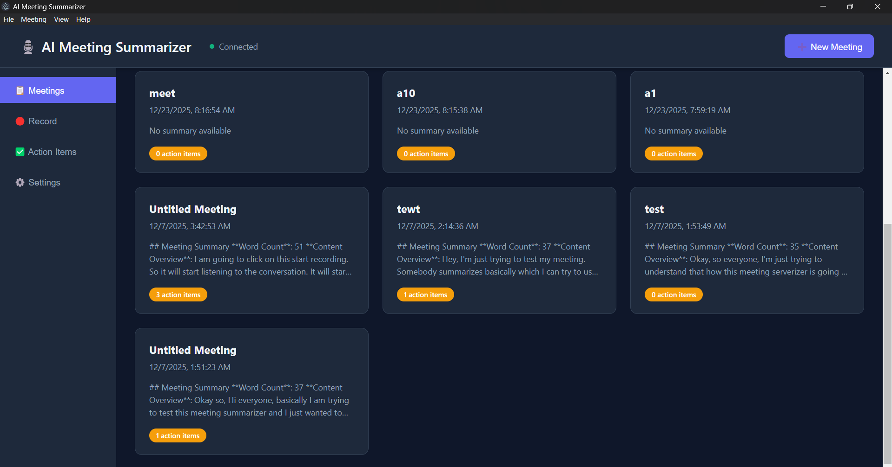
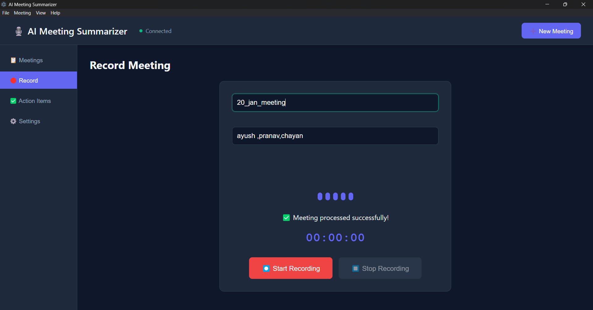
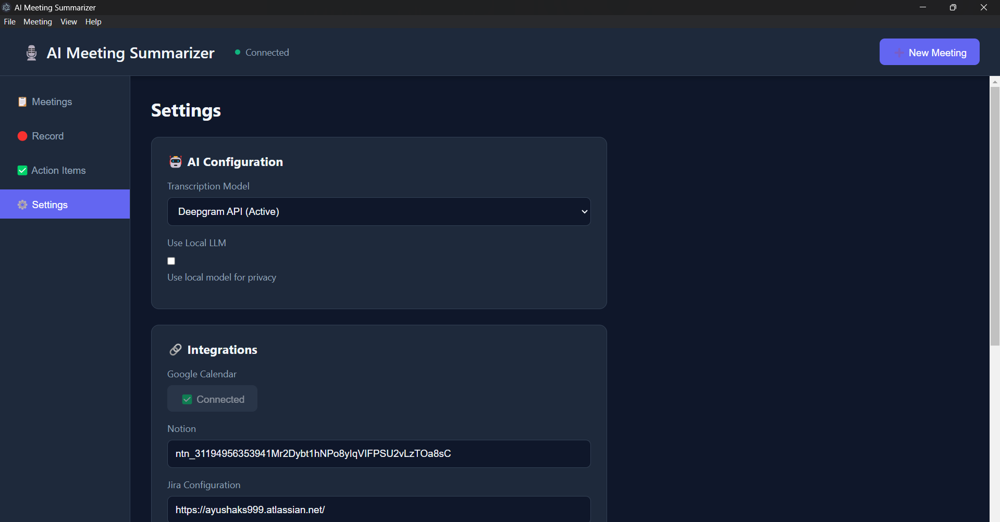

# 🎤 AI Meeting Summarizer

> A powerful desktop application that records, transcribes, summarizes, and generates actionable items from meetings using advanced AI technology.


---

## 📸 Demo / Screenshots

> (Screenshots are stored in the `screenshot/` folder)

### 📊 Meetings Dashboard



### 🎙️ Record a Meeting



### ⚙️ Settings & Integrations



---

## ✨ Features

### Core Capabilities

* 🎙️ **Local Audio Capture** — Record meetings directly from your microphone
* ⚡ **Real-Time Transcription** — See transcription appear every 10 seconds while recording
* 🤖 **AI-Powered Summarization** — Get detailed, comprehensive meeting summaries
* 📋 **Action Item Extraction** — Automatically identify tasks, assignments, and deadlines
* 🎯 **Smart Task Lists** — Auto-generated task lists with priorities and assignees
* 🔔 **Desktop Notifications** — Real-time notifications for major events

### Integrations

* 📅 **Google Calendar Sync** — Export action items as calendar events
* 📝 **Notion Export** — Send meeting notes to Notion pages
* 🎯 **Jira Task Sync** — Create Jira tasks from action items
* 🌐 **Language Translation** — Translate meetings to 12+ languages

### Additional Features

* ✏️ **Meeting Title Editing** — Edit and customize meeting titles
* 🎵 **Audio Playback** — Listen to recorded audio from meeting details
* 🔍 **Advanced Search & Filters** — Find meetings by date, title, or action item status
* 👥 **Participant Tracking** — Track meeting attendees
* 💾 **Local Storage** — All data stored locally in SQLite

---

## 🎬 Project Structure (high level)

```
AI_Meeting_Summarizer/
├── backend/                # Flask backend, transcription & AI orchestration
├── electron/               # Electron app shell
├── frontend/               # UI (HTML/CSS/JS)
├── screenshot/             # Demo screenshots (already uploaded)
├── data/                   # Local sqlite DB (ignored in git)
├── README.md
├── requirements.txt
├── package.json
└── .env.example
```

---

## 🛠️ Tech Stack

### Desktop

* **Electron** — Cross-platform desktop app

### Backend

* **Python 3.8+**
* **Flask**
* **Flask-SocketIO**
* **SQLAlchemy**
* **SQLite**

### AI Services

* **Deepgram** — Speech-to-text
* **Euron.one** — LLM for summarization/action items (configurable)
* **deep-translator** — Optional translation service

### Frontend

* **HTML/CSS/JS**
* **Socket.IO Client**
* **Axios**

---

## 📦 Installation

### Prerequisites

* Python 3.8+
* Node.js 18+
* Git

### Step 1 — Clone

```bash
git clone https://github.com/ayushaks999/AI_Meeting_Summarizer.git
cd AI_Meeting_Summarizer
```

### Step 2 — Python environment

```bash
python -m venv venv
# Windows
venv\Scripts\activate
# macOS / Linux
source venv/bin/activate

pip install -r requirements.txt
```

### Step 3 — Node packages

```bash
npm install
```

### Step 4 — Environment variables

Copy `.env.example` to `.env` and fill in keys:

```env
TRANSCRIPTION_MODEL=deepgram
DEEPGRAM_API_KEY=your_deepgram_api_key_here

USE_EURON_API=true
EURON_API_KEY=your_euron_api_key_here
EURON_API_BASE=https://api.euron.one/v1
EURON_MODEL=gpt-4.1-mini

DEBUG=False
DATABASE_PATH=data/meetings.db
```

> See `API_KEYS_GUIDE.md` for provider-specific setup steps and scopes.

---

## 🚀 Running the app (development)

1. Start backend (API + socket server)

```bash
# from repo root
python backend/app.py
```

2. Start Electron frontend (in a separate terminal)

```bash
npm run start:electron
```

> `npm start` is configured to start both backend and launch Electron in production-style mode.

---

## 🧪 Quick Start (test recording)

1. Open the app and go to **Settings** → configure Deepgram & Euron keys.
2. Go to **Record** → enter a meeting title and participants.
3. Click **Start Recording** — speak into your microphone.
4. Click **Stop Recording** — the app will send audio for transcription and summarize the meeting.
5. Visit **Meetings** to view summaries and extracted action items.

---

## 🧩 Configuration & Integrations

### Google Calendar

Follow the steps in `INTEGRATION_SETUP.md` to create OAuth credentials and link the app to a Google account.

### Notion

Provide a Notion integration token in Settings and a target page/database ID.

### Jira

Add base URL and API token in Settings. The app will use the Jira API to create issues from action items.

---

## 🧰 Development Tips

* Keep secrets out of source control — use `.env` and add `data/` and `.env` to `.gitignore`.
* To test transcription locally without hitting the API, set a `MOCK_TRANSCRIPTION=true` flag in `.env`.
* Use browser devtools to inspect socket.io messages (Electron → View → Toggle DevTools).

---

## ✅ Contributing

Contributions welcome! Please:

1. Fork this repo
2. Create a feature branch: `git checkout -b feature/your-feature`
3. Commit your changes: `git commit -m 'Add amazing feature'`
4. Push: `git push origin feature/your-feature`
5. Open a Pull Request

Please follow the code style used in the repo and include tests where applicable.

---

## 📝 Roadmap

* [ ] Speaker diarization
* [ ] Meeting templates
* [ ] Export to PDF
* [ ] Meeting analytics dashboard
* [ ] Cloud sync

---

## ⚖️ License

This project is licensed under the MIT License. See `LICENSE` for details.

---

## 📧 Contact

Made with ❤️ by **Ayush Kumar Shaw** — feel free to open issues or PRs.

GitHub: [https://github.com/ayushaks999](https://github.com/ayushaks999)

---

*If you want a variant of this README optimized for recruiters (short intro + screenshots first) or a one-page `README-lite` for demo purposes, tell me and I’ll create it.*
